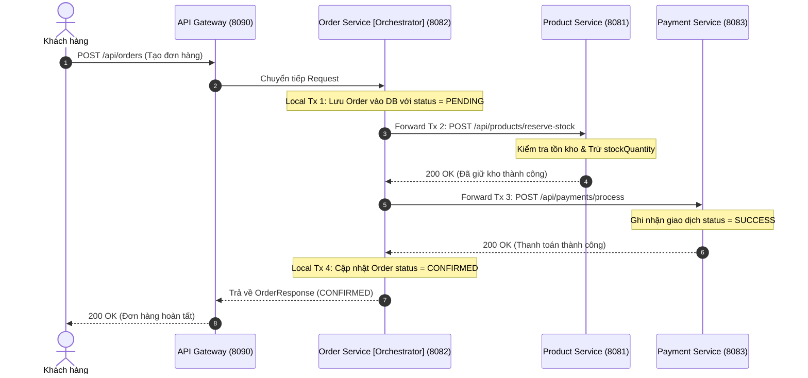
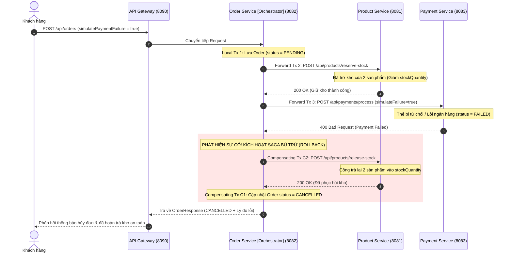

# HƯỚNG DẪN TOÀN DIỆN: THUYẾT TRÌNH & DEMO ORCHESTRATION SAGA PATTERN
> **Môn học**: Thiết kế Hệ thống Microservices (Microservice System Design)  
> **Chủ đề**: System Fault Tolerance & Data Consistency với Saga Pattern (Orchestration-based)  
> **Dự án thực tế**: Hệ thống Đặt hàng E-Commerce (`order-service`, `product-service`, `payment-service`)

---

## MỤC LỤC
1. [Nền Tảng Lý Thuyết: Distributed Transactions & Sự Cần Thiết Của Saga](#1-nền-tảng-lý-thuyết-distributed-transactions--sự-cần-thiết-của-saga)
2. [So Sánh Toàn Diện: Choreography vs Orchestration Saga](#2-so-sánh-toàn-diện-choreography-vs-orchestration-saga)
3. [Vì Sao Lựa Chọn Orchestration Saga Cho Đồ Án Này?](#3-vì-sao-lựa-chọn-orchestration-saga-cho-đồ-án-này)
4. [Kiến Trúc Hệ Thống & Các Thành Phần Tham Gia](#4-kiến-trúc-hệ-thống--các-thành-phần-tham-gia)
5. [Sơ Đồ Luồng & Các Phương Thức Kỹ Thuật Sử Dụng](#5-sơ-đồ-luồng--các-phương-thức-kỹ-thuật-sử-dụng)
6. [Kịch Bản Demo Trực Tiếp Từng Bước (Live Demo Guide)](#6-kịch-bản-demo-trực-tiếp-từng-bước-live-demo-guide)
7. [Kịch Bản Lời Thoại Thuyết Trình Mẫu (Presentation Script 7 Phút)](#7-kịch-bản-lời-thoại-thuyết-trình-mẫu-presentation-script-7-phút)
8. [Bộ Câu Hỏi Phản Biện Của Giảng Viên & Câu Trả Lời Chuẩn](#8-bộ-câu-hỏi-phản-biện-của-giảng-viên--câu-trả-lời-chuẩn)

---

## 1. Nền Tảng Lý Thuyết: Distributed Transactions & Sự Cần Thiết Của Saga

### 1.1 Vấn đề trong kiến trúc Microservices
- Trong kiến trúc Monolithic truyền thống, toàn bộ dữ liệu nằm chung trong một cơ sở dữ liệu quan hệ (RDBMS). Khi tạo đơn hàng, chúng ta chỉ cần dùng `@Transactional` của Spring để đảm bảo tính chất **ACID** (Atomicity, Consistency, Isolation, Durability). Nếu có lỗi ở bất kỳ dòng code nào, Database Engine sẽ tự động rollback toàn bộ.
- Trong kiến trúc Microservices, nguyên tắc cốt lõi là **Database-per-Service** (mỗi dịch vụ sở hữu cơ sở dữ liệu độc lập):
  - `order-service` sở hữu `order-db`
  - `product-service` sở hữu `product-db`
  - `payment-service` sở hữu `payment-db`
- **Hậu quả**: Không thể sử dụng giao dịch cục bộ ACID để can thiệp đồng thời vào 3 cơ sở dữ liệu nằm trên các máy chủ / tiến trình khác nhau.

### 1.2 Vì sao không dùng Two-Phase Commit (2PC) / XA Transactions?
Trước đây, giải pháp cổ điển cho giao dịch phân tán là **2PC (Two-Phase Commit)** gồm 2 pha (*Prepare* và *Commit*). Tuy nhiên, 2PC có những nhược điểm chí mạng trong Microservices hiện đại:
1. **Blocking & Hiệu năng kém**: Coordinator phải lock tài nguyên ở tất cả các node tham gia cho đến khi nhận được xác nhận từ tất cả các bên. Nếu mạng chậm, toàn bộ hệ thống bị treo theo (*Cascading Block*).
2. **Single Point of Failure (SPOF)**: Nếu Coordinator bị crash trong pha Prepare, các node tham gia sẽ bị khóa tài nguyên vô thời hạn (*Resource lock deadlock*).
3. **Không phù hợp với CAP Theorem**: 2PC ưu tiên Consistency tuyệt đối (C), làm suy giảm nghiêm trọng Tính khả dụng (Availability - A) và Khả năng chịu lỗi phân vùng (Partition Tolerance - P).

### 1.3 Giải pháp: Saga Pattern
- **Saga** là một mẫu thiết kế kiến trúc phân tán (được đề xuất từ năm 1987 bởi Hector Garcia-Molina và Kenneth Salem).
- Thay vì dùng một transaction phân tán duy nhất, Saga chia nhỏ nghiệp vụ lớn thành một chuỗi các **Giao dịch cục bộ (Local Transactions)**.
- Mỗi Local Transaction cập nhật dữ liệu của chính service đó.
- Nếu một bước trong chuỗi bị thất bại, hệ thống sẽ thực thi một chuỗi các **Giao dịch bù trừ (Compensating Transactions)** theo chiều ngược lại để hoàn tác những gì đã làm, đưa hệ thống về trạng thái **Nhất quán cuối cùng (Eventual Consistency)** theo mô hình **BASE** (*Basically Available, Soft state, Eventual consistency*).

---

## 2. So Sánh Toàn Diện: Choreography vs Orchestration Saga

Có 2 trường phái triển khai Saga:

| Tiêu chí | Choreography Saga (Biên đạo / Event-driven) | Orchestration Saga (Điều phối / Nhạc trưởng) |
| :--- | :--- | :--- |
| **Bản chất** | **Phi tập trung (Decentralized)**. Các service tự trao đổi với nhau qua Event Broker (Kafka/RabbitMQ). Service này nghe event của service kia và tự hành động. | **Tập trung (Centralized)**. Có một thành phần điều phối trung tâm (**Orchestrator**) nắm giữ kịch bản, trực tiếp ra lệnh cho các service tham gia. |
| **Hình tượng** | Các vũ công tự nhìn nhau để múa theo nhịp, không ai chỉ đạo. | Dàn nhạc giao hưởng với một **Nhạc trưởng** cầm gậy chỉ huy từng nhạc công. |
| **Độ phức tạp khi scale luồng** | Phù hợp với luồng ngắn (2–3 bước). Khi luồng lên đến 5–10 bước, hệ thống biến thành **"Spaghetti Events"**, rất khó vẽ lại luồng nghiệp vụ. | Dù có 10 hay 20 bước, toàn bộ logic điều phối nằm gọn trong Orchestrator, luồng nghiệp vụ cực kỳ tường minh. |
| **Khả năng Giám sát & Debug** | Khó theo dõi trạng thái hiện tại của đơn hàng (phải dò log phân tán qua Zipkin/Jaeger qua nhiều topic). | Cực kỳ dễ dàng: Orchestrator lưu trữ trực tiếp State Machine, biết chính xác đơn đang ở bước nào (PENDING, RESERVED, PAID, CANCELLED). |
| **Rủi ro phụ thuộc vòng (Cyclic Dependency)** | Rất dễ vô tình tạo thành vòng lặp vô tận giữa các service nếu cấu hình event lắng nghe chéo nhau. | Không có rủi ro phụ thuộc vòng vì các service tham gia chỉ giao tiếp với Orchestrator. |
| **Khả năng Kiểm thử (Testing)** | Khó viết integration test vì phụ thuộc vào broker và nhiều consumer bất đồng bộ. | Dễ viết Mock / Unit Test cho Orchestrator để kiểm thử cả Happy Path và Sad Path. |

---

## 3. Vì Sao Lựa Chọn Orchestration Saga Cho Đồ Án Này?

Trong bài toán **Quy trình Đặt hàng (E-Commerce Order Processing)** của hệ thống chúng ta:
1. **Nghiệp vụ có thứ tự nghiêm ngặt (Strict Sequential Order)**:
   - Bước 1: Lưu đơn hàng tạm thời (`PENDING`).
   - Bước 2: Giữ tồn kho bên `product-service` (*Reserve Stock*).
   - Bước 3: Thu tiền khách hàng bên `payment-service` (*Process Payment*).
   - Bước 4: Hoàn tất đơn hàng (`CONFIRMED`).
2. **Cần phản hồi kết quả đồng bộ cho Client/Mobile App**: Khi người dùng nhấn nút "Thanh toán", họ mong muốn nhận được kết quả tức thì (Thành công hoặc Bị từ chối), thay vì phải chờ polling một event bất đồng bộ.
3. **Dễ dàng kiểm soát giao dịch bù trừ (Compensation Flow)**: Nếu `payment-service` báo thẻ hết hạn hoặc giao dịch lỗi, Orchestrator nắm quyền kiểm soát ngay lập tức và phát lệnh hoàn kho (`release-stock`) tới `product-service` để tránh hiện tượng **"Kho treo" (Phantom Stock)**.

---

## 4. Kiến Trúc Hệ Thống & Các Thành Phần Tham Gia

Hệ thống bao gồm các microservices sau:

```
                  [Client / Postman]
                          │
                          ▼
            [API Gateway - Port 8090]
                          │
          ┌───────────────┼───────────────┐
          │ (Forward)     │ (Direct Check)│ (Direct Check)
          ▼               ▼               ▼
   [order-service] [product-service] [payment-service]
     (Port 8082)     (Port 8081)     (Port 8083)
   [ORCHESTRATOR]    [PARTICIPANT]   [PARTICIPANT]
          │               ▲               ▲
          ├─ 1. Reserve ──┘               │
          └─ 2. Process Payment ──────────┘
```

### Chi tiết các Service:
1. **`discovery-server` (Port 8761 - Netflix Eureka)**: Quản lý Service Registry, giúp các service tự động tìm thấy nhau qua tên logical (`order-service`, `product-service`, `payment-service`).
2. **`gateway-service` (Port 8090 - Spring Cloud Gateway)**: Cổng giao tiếp duy nhất định tuyến các request từ bên ngoài vào hệ thống.
3. **`order-service` (Port 8082 - SAGA ORCHESTRATOR)**:
   - Đóng vai trò **Nhạc trưởng**.
   - Quản lý trạng thái đơn hàng: `PENDING` -> `CONFIRMED` hoặc `CANCELLED`.
   - Sử dụng `ProductServiceClient` và `PaymentServiceClient` để ra lệnh cho các bên.
   - Xử lý bù trừ tự động khi gặp sự cố.
4. **`product-service` (Port 8081 - Inventory Participant)**:
   - Quản lý bảng sản phẩm và số lượng tồn kho `stockQuantity`.
   - API Forward Tx: `POST /api/products/reserve-stock` (Kiểm tra và trừ kho).
   - API Compensating Tx: `POST /api/products/release-stock` (Cộng trả lại kho).
5. **`payment-service` (Port 8083 - Payment Participant)**:
   - Quản lý giao dịch thanh toán trong bảng `payments`.
   - API Forward Tx: `POST /api/payments/process` (Xử lý trừ tiền, hỗ trợ cờ `simulateFailure` để demo).
   - API Compensating Tx: `POST /api/payments/refund/{orderId}` (Hoàn tiền giao dịch).

---

## 5. Sơ Đồ Luồng & Các Phương Thức Kỹ Thuật Sử Dụng

### 5.1 Luồng 1: Thành Công (Happy Path Flow)



---

### 5.2 Luồng 2: Thất Bại & Kích Hoạt Giao Dịch Bù Trừ (Compensating Flow)



---

### 5.3 Các Phương Thức & Kỹ Thuật Cốt Lõi Được Áp Dụng Trong Code

1. **State Machine Management (Quản lý trạng thái chuyển tiếp)**:
   - Đơn hàng không bao giờ được đặt thẳng thành `CONFIRMED`. Nó luôn khởi đầu là `PENDING`.
   - Chỉ khi mọi dịch vụ con báo thành công, trạng thái mới chuyển sang `CONFIRMED`.
   - Nếu bất kỳ bước nào ngắt quãng, trạng thái chuyển sang `CANCELLED`.
2. **Compensating Transaction (Giao dịch bù trừ ngữ nghĩa)**:
   - Trong CSDL phân tán, không có lệnh `ROLLBACK` SQL chạy xuyên nhiều database.
   - Bù trừ bản chất là một **hành động ngữ nghĩa (Semantic Action)** để đảo ngược hiệu ứng: Nếu Bước 2 là "Trừ kho 2 cái" thì Bù trừ C2 là "Cộng lại kho 2 cái".
3. **Idempotent API (Tính lũy thừa)**:
   - API hoàn trả kho `release-stock` và hoàn tiền `refund` được thiết kế để nếu Orchestrator gửi yêu cầu nhiều lần (do timeout mạng), hệ thống vẫn đảm bảo tính đúng đắn và không hoàn thừa tiền/kho.
4. **Resilience4j Circuit Breaker Integration**:
   - `ProductServiceClient` và `PaymentServiceClient` được trang bị Circuit Breaker để cô lập sự cố nếu một trong các service tham gia bị chết, ngăn chặn lỗi lan truyền làm sập `order-service`.

---

## 6. Kịch Bản Demo Trực Tiếp Từng Bước (Live Demo Guide)

### Bước 0: Khởi động các Microservices theo thứ tự
Khởi động các service qua terminal hoặc IntelliJ:
1. `discovery-server` (Port 8761)
2. `product-service` (Port 8081)
3. `payment-service` (Port 8083)
4. `order-service` (Port 8082)
5. `gateway-service` (Port 8090)

Kiểm tra Eureka Dashboard tại `http://localhost:8761` để đảm bảo 4 service đã đăng ký thành công:
- `PRODUCT-SERVICE`
- `PAYMENT-SERVICE`
- `ORDER-SERVICE`
- `GATEWAY-SERVICE`

---

### Kịch Bản 1: Happy Path — Đặt Hàng Thành Công
**Mục tiêu**: Chứng minh Orchestrator gọi tuần tự giữ kho, trừ tiền và xác nhận đơn hàng thành công.

**Lệnh cURL**:
```bash
curl -X POST http://localhost:8090/api/orders \
  -H "Content-Type: application/json" \
  -d '{
    "customerName": "Nguyen Van A",
    "customerEmail": "vana@example.com",
    "customerAddress": "123 Le Loi, TP.HCM",
    "paymentMethod": "VNPAY",
    "simulatePaymentFailure": false,
    "items": [
      {
        "productId": 1,
        "quantity": 2
      }
    ]
  }'
```

**Kết quả quan sát**:
- **HTTP Response**: `status: "CONFIRMED"`, `message: "Đặt hàng và thanh toán thành công qua Saga Orchestration."`
- **Log Console của `order-service`**:
  ```
  [SAGA ORCHESTRATOR] [STEP 1: LOCAL TX] Tạo đơn hàng ORD-XXXX ở trạng thái PENDING...
  [SAGA ORCHESTRATOR] [STEP 2: FORWARD TX] Yêu cầu Product Service giữ hàng tồn kho...
  [SAGA ORCHESTRATOR] [STEP 2 THÀNH CÔNG] Tồn kho đã được giữ thành công.
  [SAGA ORCHESTRATOR] [STEP 3: FORWARD TX] Yêu cầu Payment Service thanh toán...
  [SAGA ORCHESTRATOR] [STEP 3 THÀNH CÔNG] Thanh toán thành công! Mã GD: PAY-YYYY
  [SAGA ORCHESTRATOR] >>> SAGA HOÀN TẤT THÀNH CÔNG (CONFIRMED) CHO ĐƠN: ORD-XXXX <<<
  ```
- **Kiểm tra kho `GET http://localhost:8090/api/products/1`**: Tồn kho đã giảm đi đúng 2 đơn vị.

---

### Kịch Bản 2: Sad Path — Thanh Toán Thất Bại & Kích Hoạt Giao Dịch Bù Trừ
**Mục tiêu**: Chứng minh khi bước thanh toán thất bại, Orchestrator sẽ **tự động gọi lại Product Service để hoàn trả kho**, giải quyết triệt để lỗi "Kho treo" (Ghost Inventory).

**Lệnh cURL**:
```bash
curl -X POST http://localhost:8090/api/orders \
  -H "Content-Type: application/json" \
  -d '{
    "customerName": "Tran Thi B (Test Bù Trừ)",
    "customerEmail": "thib@example.com",
    "customerAddress": "456 Nguyen Hue, TP.HCM",
    "paymentMethod": "CREDIT_CARD",
    "simulatePaymentFailure": true,
    "items": [
      {
        "productId": 1,
        "quantity": 3
      }
    ]
  }'
```

**Kết quả quan sát**:
- **HTTP Response**: `status: "CANCELLED"`, `message: "Đơn hàng bị hủy do: Thanh toán bị từ chối... Hệ thống đã tự động kích hoạt giao dịch bù trừ (Compensating Transaction) hoàn lại tồn kho thành công!"`
- **Log Console của `order-service` (Điểm nhấn ăn điểm lớn nhất)**:
  ```
  [SAGA ORCHESTRATOR] [STEP 1: LOCAL TX] Tạo đơn hàng ORD-ZZZZ ở trạng thái PENDING...
  [SAGA ORCHESTRATOR] [STEP 2: FORWARD TX] Yêu cầu Product Service giữ hàng tồn kho...
  [SAGA ORCHESTRATOR] [STEP 2 THÀNH CÔNG] Tồn kho đã được giữ thành công.
  [SAGA ORCHESTRATOR] [STEP 3: FORWARD TX] Yêu cầu Payment Service thanh toán...
  [SAGA ORCHESTRATOR] >>> PHÁT HIỆN SỰ CỐ TẠI BƯỚC 3: THANH TOÁN THẤT BÀI! <<<
  [SAGA ORCHESTRATOR] >>> KÍCH HOẠT CHUỖI GIAO DỊCH BÙ TRỪ (COMPENSATING SAGA) <<<
  [SAGA ORCHESTRATOR] [COMPENSATING STEP C2] Gọi Product Service để hoàn trả lại số tồn kho đã giữ...
  [PRODUCT-SERVICE] [COMPENSATING ACTION: RELEASE STOCK] Đã hoàn lại 3 sản phẩm. Tồn kho sau hoàn: ...
  [SAGA ORCHESTRATOR] [COMPENSATING STEP C2 THÀNH CÔNG] Đã hoàn trả tồn kho đầy đủ.
  [SAGA ORCHESTRATOR] [COMPENSATING STEP C1] Cập nhật trạng thái đơn hàng ORD-ZZZZ sang CANCELLED...
  [SAGA ORCHESTRATOR] >>> SAGA ROLLBACK HOÀN TẤT - HỆ THỐNG ĐẠT TRẠNG THÁI NHẤT QUÁN <<<
  ```
- **Kiểm tra kho `GET http://localhost:8090/api/products/1`**: Số lượng tồn kho vẫn giữ nguyên như trước khi chạy kịch bản 2 (không hề bị mất 3 sản phẩm)!

---

### Kịch Bản 3: Hết Hàng Tại Bước 1
**Mục tiêu**: Chứng minh nếu tồn kho không đủ, Saga kết thúc ngay mà không tạo rác giao dịch sang Payment Service.

**Lệnh cURL**:
```bash
curl -X POST http://localhost:8090/api/orders \
  -H "Content-Type: application/json" \
  -d '{
    "customerName": "Le Van C",
    "customerEmail": "vanc@example.com",
    "customerAddress": "Hanoi",
    "paymentMethod": "MOMO",
    "simulatePaymentFailure": false,
    "items": [
      {
        "productId": 1,
        "quantity": 99999
      }
    ]
  }'
```
- **Kết quả**: Bị hủy ngay tại bước 2, trạng thái `CANCELLED`, `payment-service` hoàn toàn không bị gọi đến.

---

## 7. Kịch Bản Lời Thoại Thuyết Trình Mẫu (Presentation Script 7 Phút)

*Bạn có thể dựa theo kịch bản này để nói tự tin và trôi chảy trước hội đồng / lớp học:*

---

### Phút 0:00 - 1:00: Mở đầu & Đặt vấn đề
> "Kính thưa Thầy/Cô và các bạn, hôm nay nhóm em xin trình bày về chuyên đề **Triển khai Orchestration Saga Pattern để giải quyết bài toán giao dịch phân tán trong Hệ thống Microservices**.
>
> Khi chúng ta chuyển từ kiến trúc Monolith sang Microservices, mỗi service sở hữu một Database độc lập theo chuẩn *Database-per-Service*. Điều này mang lại khả năng mở rộng tuyệt vời nhưng lại đặt ra một thách thức rất lớn: **Làm thế nào để đảm bảo tính nhất quán của dữ liệu khi một giao dịch nghiệp vụ kéo dài qua nhiều service khác nhau?**
>
> Ví dụ trong quy trình Đặt hàng: Chúng ta có `Order Service`, `Product Service` (quản lý kho) và `Payment Service`. Nếu khách hàng đã bị trừ kho nhưng đến bước thanh toán thẻ bị lỗi, làm sao để kho không bị mất hàng oan? Cơ chế `@Transactional` truyền thống hoàn toàn vô hiệu giữa các database độc lập, còn Two-Phase Commit (2PC) thì lại gây khóa tài nguyên và hiệu năng quá kém. Đó chính là lý do chúng em áp dụng **Saga Pattern**."

---

### Phút 1:00 - 2:30: Saga Pattern & So sánh Orchestration vs Choreography
> "Saga giải quyết vấn đề này bằng cách chia nghiệp vụ lớn thành một chuỗi các **Local Transactions**. Mỗi service tự thực thi giao dịch trên DB của mình. Nếu một bước thất bại, hệ thống sẽ gọi các **Compensating Transactions (Giao dịch bù trừ)** theo chiều ngược lại để đưa hệ thống về trạng thái nhất quán cuối cùng.
>
> Có 2 cách tiếp cận Saga:
> 1. **Choreography (Biên đạo phi tập trung)**: Các service tự lắng nghe event của nhau qua message broker. Mô hình này phù hợp luồng ngắn, nhưng khi hệ thống phức tạp sẽ dẫn đến tình trạng *Spaghetti Events*, cực kỳ khó kiểm soát và khó debug.
> 2. **Orchestration (Nhạc trưởng tập trung)**: Có một thành phần điều phối trung tâm gọi là *Saga Orchestrator*. Orchestrator nắm toàn bộ kịch bản, ra lệnh trực tiếp cho từng service và quản lý State Machine của giao dịch.
>
> Nhóm em lựa chọn **Orchestration Saga** vì quy trình đặt hàng e-commerce đòi hỏi tính tuần tự nghiêm ngặt, cần phản hồi đồng bộ ngay cho người dùng tại API Gateway, và luồng xử lý rất rõ ràng, minh bạch."

---

### Phút 2:30 - 4:00: Thiết Kế Hệ Thống & "Chế Biến" Module
> "Trong dự án thực tế hôm nay:
> - Nhóm em đã **chế biến module `session-14-saga-patterns` thành một `payment-service` hoàn chỉnh** chạy trên port 8083, sở hữu cơ sở dữ liệu riêng, cung cấp API thanh toán và API hoàn tiền bù trừ.
> - **`order-service` (port 8082)** đóng vai trò **Saga Orchestrator - Nhạc trưởng**.
> - **`product-service` (port 8081)** đóng vai trò quản lý kho, cung cấp API giữ kho `reserve-stock` và API bù trừ `release-stock`.
> - Hệ thống kết nối qua Spring Cloud Gateway (port 8090) và Eureka Discovery Server (port 8761).
>
> Về luồng xử lý:
> - Khi nhận yêu cầu tạo đơn, Order Service lưu đơn hàng ở trạng thái `PENDING`.
> - Sau đó gọi Product Service để giữ kho (Forward Transaction 2).
> - Nếu giữ kho thành công, Order Service tiếp tục gọi Payment Service để thanh toán (Forward Transaction 3).
> - Nếu thanh toán thành công: Đơn hàng cập nhật thành `CONFIRMED`.
> - Nếu thanh toán thất bại: Orchestrator lập tức kích hoạt giao dịch bù trừ, gọi Product Service nhả lại số lượng hàng đã giữ, và cập nhật trạng thái đơn thành `CANCELLED`. Nhờ vậy, không một sản phẩm nào bị treo trong kho!"

---

### Phút 4:00 - 6:00: Trình Diễn Live Demo (Chiếu màn hình Postman & Console Log)
> "Sau đây, em xin phép demo trực tiếp 2 trường hợp trên hệ thống đang chạy:
>
> **Trường hợp 1: Happy Path (Đơn hàng thành công)**
> *(Gửi request Postman 1)*
> - Các bạn có thể thấy HTTP trả về `CONFIRMED`.
> - Nhìn vào log console của Order Service: Step 1 PENDING -> Step 2 Trừ kho thành công -> Step 3 Thanh toán thành công -> Hoàn tất Saga. Kiểm tra kho bên Product Service, số lượng đã giảm đi 2.
>
> **Trường hợp 2: Sad Path (Giả lập thanh toán lỗi & Xem giao dịch bù trừ)**
> *(Gửi request Postman 2 với simulatePaymentFailure = true)*
> - Bây giờ khách hàng đặt mua 3 sản phẩm, nhưng thẻ thanh toán bị từ chối.
> - Hãy quan sát log của Order Service:
>   + Kho đã trừ 3 sản phẩm ở Step 2.
>   + Đến Step 3: Payment Service báo lỗi `BAD REQUEST`.
>   + Ngay lập tức, Orchestrator phát hiện sự cố và in ra dòng: *`>>> KÍCH HOẠT CHUỖI GIAO DỊCH BÙ TRỪ <<<`*.
>   + Orchestrator tự động gọi `release-stock` sang Product Service để hoàn lại 3 sản phẩm.
>   + Cuối cùng, đơn hàng cập nhật thành `CANCELLED`.
> - Em xin kiểm tra lại tồn kho của sản phẩm: Số lượng vẫn nguyên vẹn 100%, hoàn toàn không có hiện tượng 'kho treo' hay mất mát dữ liệu!"

---

### Phút 6:00 - 7:00: Kết luận & Bài học kinh nghiệm
> "Tóm lại, qua bài tập này, nhóm em đã:
> 1. Nắm vững bản chất và sự đánh đổi của Saga Pattern theo mô hình BASE thay cho ACID.
> 2. Xây dựng thành công `payment-service` và tích hợp vào hệ sinh thái microservices hiện có.
> 3. Triển khai hoàn chỉnh Orchestration Saga với cơ chế bù trừ tự động và bảo vệ bởi Circuit Breaker.
>
> Em xin cảm ơn Thầy/Cô và các bạn đã lắng nghe, nhóm em rất sẵn lòng nhận các câu hỏi phản biện ạ!"

---

## 8. Bộ Câu Hỏi Phản Biện Của Giảng Viên & Câu Trả Lời Chuẩn

### Câu hỏi 1: Nhược điểm lớn nhất của Orchestration Saga là gì?
- **Trả lời**: Nhược điểm lớn nhất là **Single Point of Failure (SPOF)** và nguy cơ Orchestrator trở thành **"God Service"** tập trung quá nhiều logic nghiệp vụ nếu thiết kế không khéo. Để khắc phục, trong thực tế Orchestrator thường được scale nhiều instance và sử dụng workflow engine chuyên dụng như Camunda, Temporal hoặc Netflix Conductor để lưu state vào database phân tán.

### Câu hỏi 2: Nếu trong lúc thực thi giao dịch bù trừ (Compensating Transaction) mà Product Service bị sập thì sao?
- **Trả lời**: Đây là bài toán *Failure in Compensation*. Trong Saga, giao dịch bù trừ **bắt buộc phải thành công bằng mọi giá**. Nếu gọi API bù trừ thất bại do mạng hoặc service chết:
  1. Orchestrator sẽ lưu sự kiện bù trừ vào bảng `saga_outbox` hoặc `failed_compensations`.
  2. Một tiến trình định kỳ (**Background Job / Retry Worker**) với cơ chế Exponential Backoff sẽ tự động thử lại cho đến khi thành công.
  3. Nếu sau N lần vẫn lỗi, hệ thống sẽ kích hoạt cảnh báo (Alerting) tới quản trị viên để can thiệp thủ công.

### Câu hỏi 3: Tại sao giao dịch bù trừ lại cần tính lũy thừa (Idempotency)?
- **Trả lời**: Vì trong môi trường mạng phân tán, khi Orchestrator gọi lệnh bù trừ nhưng bị timeout, Orchestrator không biết service đối phương đã hoàn kho hay chưa nên sẽ gửi lại request (Retry). Nếu API không có tính Idempotent, sản phẩm sẽ bị cộng dồn 2 lần (ví dụ hoàn 3 cái thành hoàn 6 cái), làm sai lệch số liệu tồn kho. Do đó, API hoàn kho cần kèm theo `orderId` làm khóa định danh duy nhất (Idempotency Key).

### Câu hỏi 4: Khi nào thì nên dùng Choreography thay vì Orchestration?
- **Trả lời**: Nên dùng Choreography khi quy trình nghiệp vụ rất đơn giản (chỉ gồm 2 đến 3 service tham gia), hệ thống đã xây dựng sẵn hạ tầng Event Streaming mạnh mẽ (Kafka, RabbitMQ) và các service có tính độc lập cao, không cần điều phối tập trung. Khi quy trình phức tạp từ 4 service trở lên hoặc cần truy vấn trạng thái đơn hàng tức thì, Orchestration luôn là sự lựa chọn an toàn và hiệu quả hơn.
